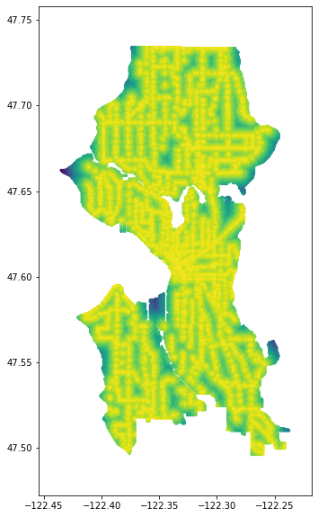
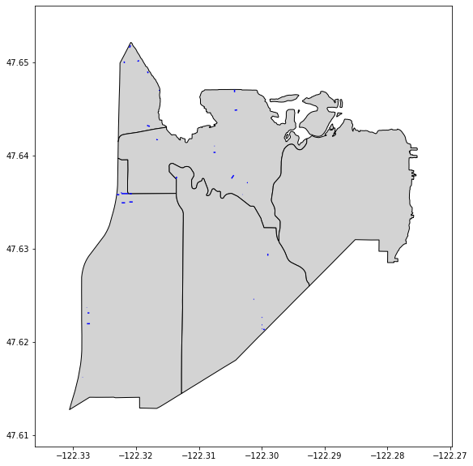
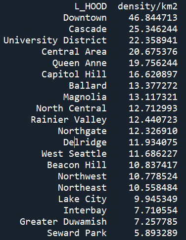

# Seattle Accessibility CLI

A command-line tool for analyzing urban accessibility in Seattle using transit stops and public stairways.

## Features

- Generate maps of stops or stairways
- Create heatmaps showing distance to nearest accessibility point
- Rank neighborhoods by total count or density of stops or stairways

## Example commands:

```bash
heatmap stops d=100
```



```bash
map stairs Capitol Hill
```



```bash
rank districts by stop density
```



## Usage

Commands follow this structure:
- heatmap [stairs|stops] d=[separation] [neighborhood]
- map [stairs|stops] [neighborhood]
- rank [districts/neighborhoods] by [stair|stop] [total|density] 
- end (ends the session)
- help (displays this text box)

**Notes:**

- Omit neighborhood/district name to map the entire city. 
- Omit separation value when drawing a heatmap to set to default 100m
- Omit [districts/neighborhoods] when ranking to rank districts by default
- Capitalize neighborhood/district names, nothing else.

## Installation

pip install -r requirements.txt
python main.py

## Project Structure

main.py # CLI entry point 
prompt.py # command parsing 
analysis.py # develops graphs and charts 
data_loader.py # data loading and caching

## sources

- data/stops.txt as transit stop data from https://www5.kingcounty.gov/sdc?Layer=TRANSITSTOP_POINT

- data/stairs.geojson as stair data from https://data-seattlecitygis.opendata.arcgis.com/datasets/5dcd34dcd042430f9b134b8e2854d149_0/explore?location=47.645422%2C-122.365572%2C13

- data/neighborhoods.geojson as neighborhood data from https://data-seattlecitygis.opendata.arcgis.com/datasets/SeattleCityGIS::neighborhood-map-atlas-neighborhoods/explore?location=47.614610%2C-122.336918%2C11

